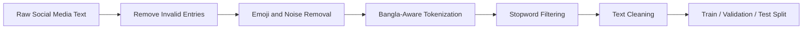
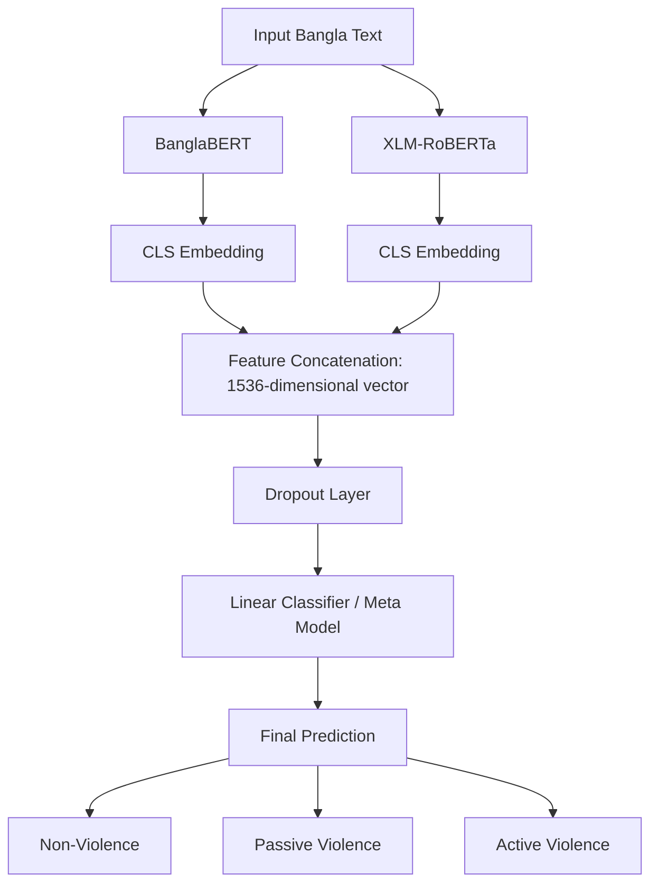
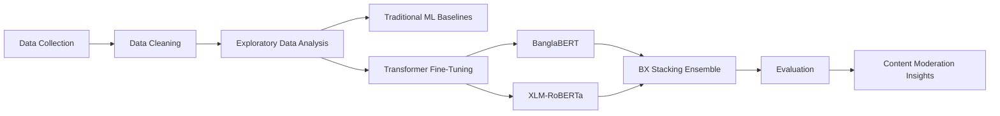

<div align="center">

# 🇧🇩 Multi-Source Bangla Violence Text Dataset  
## Transformer-Based Stacking Ensemble for Social Media Content Moderation

### A Bangla NLP research project for detecting violence-related social media text using a **BX Stacking Ensemble** of **BanglaBERT** and **XLM-RoBERTa**

<br>


<br>

**Violence Detection • BanglaBERT • XLM-RoBERTa • Stacking Ensemble • Social Media NLP • Low-Resource Language Processing**

</div>

---

## 🌍 Project Overview

Social media platforms such as **Facebook**, **YouTube**, and **TikTok** have transformed communication in Bengali-speaking communities. At the same time, the rapid growth of user-generated content has increased the spread of harmful, aggressive, and violence-inciting language.

This repository presents a research project on **Bangla violence-related text detection** using a newly expanded multi-source dataset and a transformer-based stacking ensemble model.

The proposed model, named **BX Stacking Ensemble**, combines:

- **BanglaBERT** for Bangla-specific linguistic representation  
- **XLM-RoBERTa** for multilingual contextual robustness  
- **A stacking classifier** to combine both transformer representations for final prediction  

The system achieves a **Macro F1-score of 0.85**, outperforming traditional machine learning models and individual transformer baselines.

---

## ✨ Key Contributions

| Contribution | Description |
|---|---|
| 📌 **Multi-Source Bangla Dataset** | Built a larger dataset of **11,933 Bangla social media text samples** |
| 🌐 **Platform Diversity** | Integrated data from **Vio-Lens**, **YouTube**, **Facebook**, and **TikTok** |
| 🧠 **BX Stacking Ensemble** | Proposed a transformer ensemble combining **BanglaBERT + XLM-RoBERTa** |
| 🏷️ **Three-Class Classification** | Classified content into **Non-Violence**, **Passive Violence**, and **Active Violence** |
| ⚖️ **Imbalance-Aware Training** | Used stratified splitting and weighted loss to address class imbalance |
| 🚀 **Improved Performance** | Achieved **Macro F1 = 0.85**, the best result among evaluated models |
| 🛡️ **Social Impact** | Supports safer Bangla digital communication and responsible content moderation research |

---

## 🧾 Paper Information

**Title:**  
**Multi-Source Bangla Violence Text Dataset and Transformer-Based Stacking Ensemble for Social Media Content Moderation**

**Authors:**  
- Maliha Rahman Moon  
- Md. Siam  
- Asmita Hoque Pospita  
- Hrithik Majumdar Shibu  

**Affiliations:**  
- Department of Computer Science and Engineering, R. P. Shaha University, Narayanganj, Bangladesh  
- School of Computer Science and Electronic Engineering, University of Essex, Colchester, United Kingdom  

**Keywords:**  
`Violence Detection`, `Bangla NLP`, `BanglaBERT`, `XLM-RoBERTa`, `Stacking Ensemble`, `Text Classification`, `Content Moderation`

---

## 🗂️ Dataset Description

The dataset contains **11,933 Bangla social media text samples** collected from existing and newly gathered sources.

### Dataset Sources

| Source | Description |
|---|---|
| **Vio-Lens Dataset** | Existing Bangla communal violence-related social media dataset |
| **YouTube** | Public comments from news, social, political, and event-related videos |
| **Facebook** | Public comments from national news pages and public posts |
| **TikTok** | Public short-form content reactions and comments |

---

## 🏷️ Label Categories

| Label | Class Name | Description |
|---|---|---|
| `0` | **Non-Violence** | Peaceful, neutral, or harmless content |
| `1` | **Passive Violence** | Indirect aggression, discriminatory tone, sarcasm, or justification of harmful action |
| `2` | **Active Violence** | Direct threat, abuse, or explicit aggressive expression |

---

## 📊 Dataset Distribution

| Class | Samples | Percentage |
|---|---:|---:|
| **Non-Violence** | 5,152 | 43.2% |
| **Passive Violence** | 3,907 | 32.7% |
| **Active Violence** | 2,874 | 24.1% |
| **Total** | **11,933** | **100%** |

---

## 🔎 Dataset Characteristics

The dataset reflects the complexity of real-world Bangla social media language, including:

- informal spelling variation  
- slang and colloquial expressions  
- short-form social media comments  
- socio-political and religious vocabulary  
- platform-specific language style  
- noisy user-generated text  
- code-mixing and non-standard grammar  

### Text Length Statistics

| Metric | Value |
|---|---:|
| Minimum Text Length | 3 |
| Maximum Text Length | 640 |
| Mean Text Length | 90.49 |
| Standard Deviation | 78.54 |

---

## 🧹 Preprocessing Pipeline

The preprocessing pipeline was designed to clean noisy social media text while preserving meaningful Bangla linguistic signals.



### Main Preprocessing Steps

- removed invalid and missing entries  
- removed emojis and unnecessary symbols  
- preserved Bangla Unicode characters  
- applied Bangla-aware tokenization  
- removed Bengali and English stopwords  
- removed excessive punctuation, digits, and whitespace  
- created a cleaned text column while preserving the original text  
- split the dataset into **70% train**, **15% validation**, and **15% test**

---

## 🧠 Proposed Model: BX Stacking Ensemble

The proposed model is named **BX Stacking Ensemble**:

- **B** = BanglaBERT  
- **X** = XLM-RoBERTa  

The architecture extracts contextual embeddings from both transformer models, concatenates them into a single representation, and passes the combined feature vector through a meta-classifier.



### Why BX Ensemble?

BanglaBERT captures **Bangla-specific linguistic patterns**, while XLM-RoBERTa contributes **multilingual contextual understanding**. Their combination improves robustness for noisy, informal, and diverse Bangla social media text.

---

## ⚙️ Experimental Setup

| Component | Configuration |
|---|---|
| Train / Validation / Test Split | 70 / 15 / 15 |
| Random Seed | 42 |
| Transformer Max Sequence Length | 256 |
| Optimizer | AdamW |
| Learning Rate | 2e-5 to 3e-5 |
| Batch Size | 16 |
| Loss Function | Weighted Cross-Entropy |
| Training Strategy | Mixed Precision FP16 |
| Evaluation Metrics | Accuracy, Precision, Recall, Macro F1 |

---

## 🧪 Models Evaluated

The study evaluates three major groups of models.

### 1. Traditional Machine Learning Models

- Logistic Regression  
- Support Vector Machine  
- TF-IDF word-level features  
- Character n-gram features  
- Word embedding features  

### 2. Transformer-Based Models

- BanglaBERT  
- SagorBERT  
- mBERT Cased  
- mBERT Uncased  
- XLM-RoBERTa  

### 3. Proposed Ensemble Model

- **BX Stacking Ensemble: BanglaBERT + XLM-RoBERTa**

---

## 📊 Results

### Model Performance Comparison

| Model | Non-Violence F1 | Passive Violence F1 | Active Violence F1 | Macro F1 |
|---|---:|---:|---:|---:|
| Unigram + SVM | 0.77 | 0.69 | 0.70 | 0.72 |
| Bigram + LR | 0.63 | 0.34 | 0.41 | 0.46 |
| Trigram + LR | 0.30 | 0.61 | 0.01 | 0.26 |
| U+B+T + SVM | 0.78 | 0.70 | 0.70 | 0.73 |
| C3-Gram + SVM | 0.80 | 0.73 | 0.73 | 0.75 |
| C4-Gram + SVM | 0.80 | 0.74 | 0.76 | 0.77 |
| C5-Gram + SVM | 0.81 | 0.74 | 0.78 | 0.78 |
| C3+C4+C5 + SVM | 0.81 | 0.75 | 0.77 | 0.78 |
| SagorBERT | 0.81 | 0.74 | 0.79 | 0.78 |
| BanglaBERT | 0.83 | 0.77 | 0.81 | 0.80 |
| mBERT Cased | 0.80 | 0.75 | 0.77 | 0.77 |
| mBERT Uncased | 0.82 | 0.75 | 0.78 | 0.79 |
| XLM-RoBERTa | 0.82 | 0.76 | 0.80 | 0.79 |
| **BX Ensemble Proposed** | **0.90** | **0.88** | **0.78** | **0.85** |

---

## 🏆 Performance Highlights

<div align="center">

| Best Traditional ML | Best Individual Transformer | Proposed Model |
|---|---|---|
| C3+C4+C5 + SVM | BanglaBERT | **BX Ensemble** |
| Macro F1: **0.78** | Macro F1: **0.80** | Macro F1: **0.85** |

</div>

The **BX Stacking Ensemble** achieved the highest Macro F1-score, showing that combining Bangla-specific and multilingual transformer representations can improve violence-related text classification.

---

## 📈 Statistical Validation

To assess whether the BX Ensemble improvement over XLM-RoBERTa was statistically meaningful, a paired two-tailed t-test was performed using per-class F1-scores.

| Test | Value |
|---|---:|
| t-statistic | 5.67 |
| p-value | 0.00047 |
| Significance Threshold | 0.05 |

The result indicates that the improvement is statistically significant and unlikely to be due to random variation.

---

## 📁 Suggested Repository Structure

```bash
bangla-violence-detection-bx-ensemble/
│
├── README.md
├── requirements.txt
├── LICENSE
│
├── data/
│   ├── raw/
│   ├── processed/
│   └── README_DATA.md
│
├── notebooks/
│   ├── 01_dataset_preprocessing.ipynb
│   ├── 02_eda_visualization.ipynb
│   ├── 03_traditional_ml_baselines.ipynb
│   ├── 04_transformer_training.ipynb
│   └── 05_bx_ensemble_training.ipynb
│
├── src/
│   ├── preprocessing.py
│   ├── dataset.py
│   ├── train_traditional_ml.py
│   ├── train_transformers.py
│   ├── train_bx_ensemble.py
│   ├── evaluate.py
│   └── utils.py
│
├── models/
│   └── saved_checkpoints/
│
├── results/
│   ├── classification_reports/
│   ├── confusion_matrices/
│   └── model_comparison.csv
│
├── assets/
│   ├── dataset_pipeline.png
│   ├── bx_architecture.png
│   └── macro_f1_comparison.png
│
└── paper/
    └── paper.pdf
```

---

## 🚀 Quick Start

### 1. Clone the Repository

```bash
git clone https://github.com/your-username/bangla-violence-detection-bx-ensemble.git
cd bangla-violence-detection-bx-ensemble
```

### 2. Create a Virtual Environment

```bash
python -m venv venv
source venv/bin/activate
```

For Windows:

```bash
venv\Scripts\activate
```

### 3. Install Dependencies

```bash
pip install -r requirements.txt
```

### 4. Train Traditional ML Baselines

```bash
python src/train_traditional_ml.py
```

### 5. Fine-Tune Transformer Models

```bash
python src/train_transformers.py
```

### 6. Train BX Stacking Ensemble

```bash
python src/train_bx_ensemble.py
```

### 7. Evaluate Models

```bash
python src/evaluate.py
```

---

## 📦 Requirements

```txt
python>=3.10
torch
transformers
scikit-learn
pandas
numpy
matplotlib
seaborn
bnlp-toolkit
nltk
tqdm
optuna
```

---

## 🧭 Research Workflow



---

## 🛡️ Ethical and Responsible Use

This project is intended for research and safety-focused content moderation.

### Recommended Use

- academic research  
- Bangla NLP benchmarking  
- harmful-content detection research  
- content moderation support systems  
- low-resource language safety studies  

### Not Recommended Use

- automated punishment without human review  
- surveillance of private users  
- deployment without bias and fairness testing  
- use outside the linguistic and cultural context of Bangla text  

Because violence-related language can be context-sensitive, any real-world deployment should include:

- human oversight  
- fairness evaluation  
- transparent appeal mechanisms  
- careful domain adaptation  
- regular model updating  

---

## 🔬 Limitations

Although the proposed model performs strongly, several limitations remain:

- transformer models require significant computational resources  
- real-time deployment may require model compression or distillation  
- Bangla social media language changes rapidly over time  
- sarcasm, coded language, and context-dependent expressions remain challenging  
- publicly available Bangla datasets are still limited  
- broader cross-platform and cross-domain validation is needed  

---

## 🔮 Future Work

Future research can extend this project by:

- expanding the dataset with more recent social media content  
- improving annotation consistency and inter-annotator agreement  
- adding explainability methods such as SHAP or attention visualization  
- testing lightweight transformer models for real-time deployment  
- improving detection of sarcasm and implicit aggression  
- evaluating fairness across dialects, regions, and platform types  
- building a human-in-the-loop moderation pipeline  
- releasing a public benchmark for Bangla violence detection  

---

## 📌 Citation

If you use this work, please cite the paper. Update the venue details after official publication.

```bibtex
@inproceedings{moon2026banglaviolence,
  title={Multi-Source Bangla Violence Text Dataset and Transformer-Based Stacking Ensemble for Social Media Content Moderation},
  author={Moon, Maliha Rahman and Siam, Md. and Pospita, Asmita Hoque and Shibu, Hrithik Majumdar},
  booktitle={Proceedings of ICCSC 2026},
  year={2026}
}
```

---

## 👥 Authors

| Author | Affiliation |
|---|---|
| Maliha Rahman Moon | Department of CSE, R. P. Shaha University |
| Md. Siam | Department of CSE, R. P. Shaha University |
| Asmita Hoque Pospita | Department of CSE, R. P. Shaha University |
| Hrithik Majumdar Shibu | School of Computer Science and Electronic Engineering, University of Essex |

---

## 🤝 Acknowledgements

This work builds on prior Bangla violence detection research, including the **Vio-Lens dataset** and Bangla Language Processing shared task resources. We acknowledge the importance of open research in building safer, fairer, and more socially responsible NLP systems for low-resource languages.

---

## ⭐ Support This Research

If this repository helps your research, please consider giving it a star.

<div align="center">

### Bangla NLP needs more open, ethical, and socially useful research.

<br>

**Made with ❤️ for safer Bengali digital spaces**

</div>
